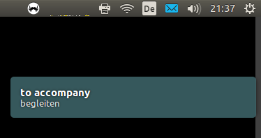

Offline Dict Trainer
====================

For people like me who have collected a lot of vocabulary on [dict.cc](http://www.dict.cc)
and want to actually learn it. This, I suppose, is best done offline with
regular reminders popping up every 5 minutes, or so.

So, I wrote a script showing vocables in adjustable frequencies.
It uses native notifications, only GNOME is supported (yet). Looks like:

How to run
----------
1. Go to dict.cc, login and choose a vocabulary lists to export.
   Navigate to the bilingual export (tab-separated txt).
   Either you download the txt manually or you copy the link to it.
2. Open `config.yaml`, enter the paths to your local source files
   (for now pointing to `./samples/*`) and edit the settings to your liking.
   Put the link to the respective remote source (copied in step 1.) in the
   list of remotes; NOTE that local and remote URLs have to match in order!
3. Run `python dict_trainer.py`. You'll need Python 3 or higher.
   The process will not demonize, let it run (verbosely) in the terminal.
   Stop it with Cmd-C, no pausing is possible (yet), it stops after each
   vocable was presented once. If you want another round, restart.

Features
--------
* load vocabulary data from multiple files
* shuffled but ranked by "last seen" date or "totally seen" counter
* adjustable duration of/between popups

Disclaimer
----------
* Notifications currently only support GNOME.
* Your dict.cc password for the downloader is stored in plain text :(
  If you don't want that, download the exported files manually.
